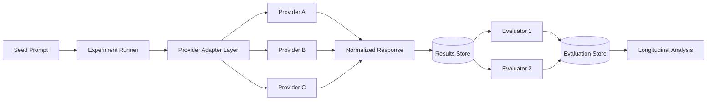

# AI Model Longitudinal Lab

A public reference implementation for running controlled prompts across multiple AI providers, normalizing responses, storing results, and comparing behavior over time.

## Executive Lens

The useful question is not whether an AI model can produce a strong answer once. It is whether behavior can be measured, compared, reproduced, governed, and explained over time. This reference architecture treats AI evaluation as an operational system rather than a collection of ad hoc prompts.

**Leadership questions this design addresses:**

- How do we compare providers without binding the experiment to one vendor?
- How do we separate generation from evaluation to reduce methodological contamination?
- What provenance must be preserved to reproduce a result months later?
- How do we detect drift, variability, cost changes, or schema failures over time?
- How do we make AI experiments auditable enough to support business decisions?

This repository demonstrates the architecture and engineering patterns behind a longitudinal AI evaluation system. It is intentionally separated from any production, commercial, proprietary, or customer-specific implementation.

## What This Project Demonstrates

- Provider-agnostic AI integrations
- Repeatable experiment execution
- Longitudinal comparison across time
- Within-day repeat sampling
- Normalized storage across heterogeneous providers
- Evaluator separation from generation models
- Reproducibility and auditability
- Request/output fingerprinting
- Prompt and schema versioning
- Structured-output validation
- Token and estimated-cost accounting
- Failure isolation and retry-safe design
- Environment-based secret management

## Reference Architecture



## Core Concepts

### Seed
A controlled prompt or task introduced on a defined schedule.

### Run
One execution of a seed against one provider/model at a specific point in time.

### Repeat
A repeated execution of the same seed within a short window to observe response variability.

### Longitudinal observation
A repeat of a prior seed at a later date to detect behavioral or output changes over time.

### Evaluator
A separate scoring or analysis layer that assesses generated responses using a stable rubric.

## Example Sampling Pattern

A seed might be evaluated at:

- minute 0
- minute 5
- minute 15
- minute 30

and then revisited later at defined day offsets.

The exact schedule is configurable rather than embedded into provider adapters.

## Repository Layout

```text
ai-model-longitudinal-lab/
├── docs/
│   ├── architecture.md
│   ├── methodology.md
│   └── provider-normalization.md
├── database/
│   └── schema.sql
├── src/
│   ├── providers/
│   │   ├── provider-interface.ts
│   │   └── mock-provider.ts
│   └── runner/
│       └── experiment-runner.ts
├── examples/
│   └── seed.example.json
├── .env.example
├── .gitignore
└── README.md
```

## Running the Reference Example

The included provider is a mock adapter so the project can be explored without any paid AI account or API key.

The production pattern is:

1. Load seed configuration.
2. Select enabled providers.
3. Execute through a common provider interface.
4. Normalize the provider response.
5. Persist immutable run metadata and output.
6. Evaluate separately.
7. Compare results across repeats and time.

## Design Principles

**Provider isolation**  
Provider-specific request and response formats stay inside adapters.

**Immutable run records**  
A historical experiment result should never be silently overwritten.

**Evaluation separation**  
Generation and scoring are distinct operations.

**Reproducibility**  
Prompt text, model identifier, parameters, timestamps, and run metadata are preserved.

**Failure transparency**  
Errors are captured as experiment events rather than hidden.

**No secrets in source control**  
API keys belong in environment variables or a secret manager.

## Production vs. Public Reference

This repository is a portfolio-safe reference architecture. It does not contain production credentials, proprietary datasets, commercial publishing logic, private evaluation results, or internal workflow configuration.

## Tradeoffs and Decisions

- **Provider abstraction:** improves comparability and portability, while hiding some provider-specific capabilities unless they are modeled explicitly.
- **Immutable run records:** protects historical evidence, at the cost of greater storage and version-management requirements.
- **Separate evaluators:** improves analytical discipline but adds cost and operational complexity.
- **Versioned pricing and schemas:** makes historical comparisons more defensible, but requires careful catalog maintenance.

## What I Would Improve Next

I would add production-grade provider adapters, queue-based experiment execution, structured evaluator rubrics, statistical comparison helpers, richer reporting, and more explicit controls for model/version retirement. From a governance standpoint, I would also connect experiment evidence to approval criteria for when an AI capability is ready for operational use.

## Planned Enhancements

- Concrete provider adapter examples
- Retry/backoff policy
- Queue-based execution
- Structured evaluator rubrics
- Provider-specific schema adapters
- Statistical comparison helpers
- Reporting notebook

## Validation

This reference implementation is checked in GitHub Actions. CI runs the TypeScript test suite and strict type-checking on pushes and pull requests to `main`.

## Architecture Deep Dive

- [Case study](docs/case-study.md)
- [Architecture decisions](docs/adr/README.md)
- [Reliability and recovery](docs/reliability-recovery.md)

## Operations Deep Dive

- [Observability and service signals](docs/observability.md)
- [Incident runbook](docs/runbook.md)
- [Example incident scenario](docs/incident-scenario.md)
- [Metrics catalog](examples/metrics-catalog.json)


## AI Governance Controls

The reference implementation includes controls for experiment provenance and AI operational accountability:

- deterministic request fingerprints
- output hashes
- prompt and schema versions
- source-reference metadata
- structured JSON contract validation
- input/output token accounting
- versioned cost estimation

See [AI provenance, versioning, validation, and cost controls](docs/ai-governance-controls.md).

An [illustrative pricing catalog](examples/pricing-catalog.example.json) demonstrates how pricing should be versioned by effective date. It intentionally does not claim to contain current provider pricing.
