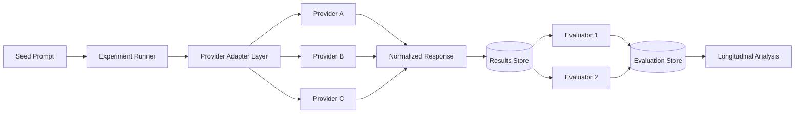

# AI Model Longitudinal Lab

A public reference implementation for running controlled prompts across multiple AI providers, normalizing responses, storing results, and comparing behavior over time.

This repository demonstrates the architecture and engineering patterns behind a longitudinal AI evaluation system. It is intentionally separated from any production, commercial, proprietary, or customer-specific implementation.

## What This Project Demonstrates

- Provider-agnostic AI integrations
- Repeatable experiment execution
- Longitudinal comparison across time
- Within-day repeat sampling
- Normalized storage across heterogeneous providers
- Evaluator separation from generation models
- Reproducibility and auditability
- Failure isolation and retry-safe design
- Environment-based secret management

## Reference Architecture



## Core Concepts

### Seed
A controlled prompt or task introduced on a defined schedule.

### Run
One execution of a seed against one provider/model at a specific point in time.

### Repeat
A repeated execution of the same seed within a short window to observe response variability.

### Longitudinal observation
A repeat of a prior seed at a later date to detect behavioral or output changes over time.

### Evaluator
A separate scoring or analysis layer that assesses generated responses using a stable rubric.

## Example Sampling Pattern

A seed might be evaluated at:

- minute 0
- minute 5
- minute 15
- minute 30

and then revisited later at defined day offsets.

The exact schedule is configurable rather than embedded into provider adapters.

## Repository Layout

```text
ai-model-longitudinal-lab/
├── docs/
│   ├── architecture.md
│   ├── methodology.md
│   └── provider-normalization.md
├── database/
│   └── schema.sql
├── src/
│   ├── providers/
│   │   ├── provider-interface.ts
│   │   └── mock-provider.ts
│   └── runner/
│       └── experiment-runner.ts
├── examples/
│   └── seed.example.json
├── .env.example
├── .gitignore
└── README.md
```

## Running the Reference Example

The included provider is a mock adapter so the project can be explored without any paid AI account or API key.

The production pattern is:

1. Load seed configuration.
2. Select enabled providers.
3. Execute through a common provider interface.
4. Normalize the provider response.
5. Persist immutable run metadata and output.
6. Evaluate separately.
7. Compare results across repeats and time.

## Design Principles

**Provider isolation**  
Provider-specific request and response formats stay inside adapters.

**Immutable run records**  
A historical experiment result should never be silently overwritten.

**Evaluation separation**  
Generation and scoring are distinct operations.

**Reproducibility**  
Prompt text, model identifier, parameters, timestamps, and run metadata are preserved.

**Failure transparency**  
Errors are captured as experiment events rather than hidden.

**No secrets in source control**  
API keys belong in environment variables or a secret manager.

## Production vs. Public Reference

This repository is a portfolio-safe reference architecture. It does not contain production credentials, proprietary datasets, commercial publishing logic, private evaluation results, or internal workflow configuration.

## Planned Enhancements

- Concrete provider adapter examples
- Retry/backoff policy
- Queue-based execution
- Structured evaluator rubrics
- Statistical comparison helpers
- Reporting notebook

## Validation

This reference implementation is checked in GitHub Actions. CI runs the TypeScript test suite and strict type-checking on pushes and pull requests to `main`.
