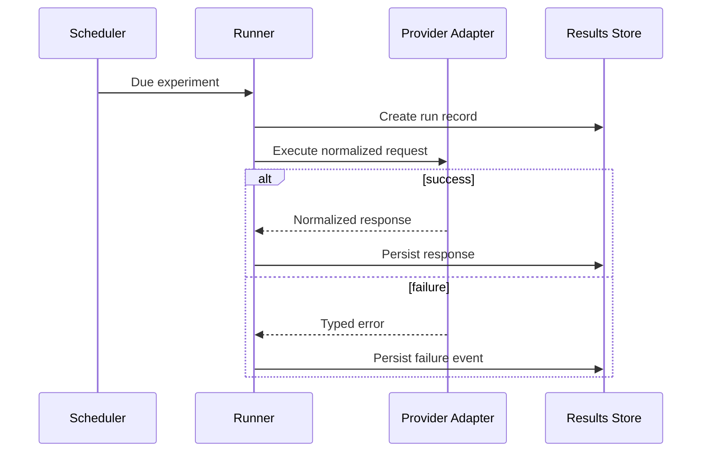

# Architecture

## Goal

The system is designed to answer a deceptively simple question:

> If the same controlled task is presented to AI systems repeatedly over time, how stable are the responses?

The architecture separates experiment definition, provider execution, storage, evaluation, and analysis so each layer can evolve independently.

## Components

### 1. Seed Registry
Stores the canonical experiment prompt and metadata.

A seed should include:

- stable identifier
- prompt text
- category
- creation timestamp
- sampling policy
- optional generation parameters

### 2. Experiment Runner
Coordinates execution without knowing provider-specific API details.

Responsibilities:

- select due experiments
- create run IDs
- invoke provider adapters
- capture timing
- persist success or failure
- avoid duplicate execution

### 3. Provider Adapter Layer
Each provider implements a common contract.

The runner should not care whether a provider uses:

- messages
- content blocks
- completion text
- nested candidates
- custom token accounting

Adapters translate provider-specific behavior into one normalized result.

### 4. Results Store
Stores immutable experiment observations.

Each observation should preserve:

- seed ID
- run ID
- provider
- model
- request timestamp
- completion timestamp
- latency
- normalized output
- provider metadata
- error information
- generation parameters

### 5. Evaluation Layer
Evaluators operate after generation.

This avoids contaminating generation logic with scoring logic and allows the same result to be re-evaluated later using a revised rubric.

### 6. Analysis Layer
Longitudinal analysis compares:

- within-run variability
- provider-to-provider differences
- model changes
- later repeats of the same seed
- evaluator agreement

## Reliability Pattern

A failed provider call should not invalidate successful calls to other providers.
